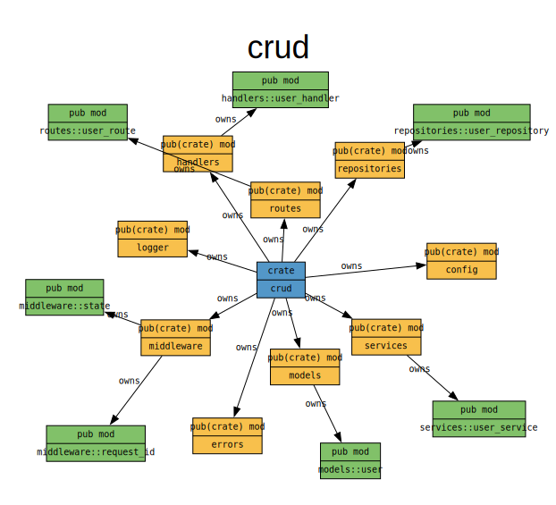

# Rust CRUD

Axum + SQLx + PostgreSQL CRUD API with structured JSON logging.

## Quick Start

```bash
# 1. Start Postgres
docker-compose up -d

# 2. Copy env
cp .env.example .env

# 3. Install sqlx-cli (runs migrations)
cargo install sqlx-cli --no-default-features --features postgres

# 4. Run
cargo run

```

## Migrations

### Migrate

```bash
sqlx migrate run
```

### Generate `.sqlx` cache folder

```bash
cargo sqlx prepare
```

## API Endpoints

| Method | Path              | Description |
| ------ | ----------------- | ----------- |
| GET    | /api/v1/users     | List users  |
| POST   | /api/v1/users     | Create user |
| GET    | /api/v1/users/:id | Get user    |
| PATCH  | /api/v1/users/:id | Update user |
| DELETE | /api/v1/users/:id | Delete user |

## Example Requests

```bash
# Create
curl -X POST http://localhost:8080/api/v1/users \
  -H "Content-Type: application/json" \
  -d '{"name":"Alice","email":"alice@example.com","bio":"Hello!"}'

# List with pagination
curl "http://localhost:8080/api/v1/users?page=1&per_page=10"

# Update (partial)
curl -X PATCH http://localhost:8080/api/v1/users/<uuid> \
  -H "Content-Type: application/json" \
  -d '{"name":"Alice Updated"}'

# Delete
curl -X DELETE http://localhost:8080/api/v1/users/<uuid>
```

## Cargo Modules

```rust
crate crud
├── mod config: pub(crate)
│   └── struct Config: pub
│       └── fn from_env: pub
├── mod errors: pub(crate)
│   ├── enum AppError: pub
│   │   └── fn into_response: pub(self)
│   └── type AppResult: pub
├── mod handlers: pub(crate)
│   └── mod user_handler: pub
│       ├── async fn create_user: pub
│       ├── async fn delete_user: pub
│       ├── async fn get_user: pub
│       ├── async fn list_users: pub
│       └── async fn update_user: pub
├── mod logger: pub(crate)
│   └── fn init: pub
├── async fn main: pub(crate)
├── mod middleware: pub(crate)
│   ├── mod request_id: pub
│   │   ├── fn extract_request_id: pub
│   │   └── async fn propagate_request_id: pub
│   └── mod state: pub
│       └── struct AppState: pub
│           └── fn new: pub
├── mod models: pub(crate)
│   └── mod user: pub
│       ├── struct CreateUserRequest: pub
│       ├── struct PaginatedResponse: pub
│       ├── struct PaginationQuery: pub
│       ├── struct UpdateUserRequest: pub
│       ├── struct UserResponse: pub
│       ├── struct UserRow: pub
│       ├── fn default_page: pub(self)
│       └── fn default_per_page: pub(self)
├── mod repositories: pub(crate)
│   └── mod user_repository: pub
│       ├── struct PgUserRepository: pub
│       │   ├── async fn create: pub(self)
│       │   ├── async fn delete: pub(self)
│       │   ├── async fn find_all: pub(self)
│       │   ├── async fn find_by_email: pub(self)
│       │   ├── async fn find_by_id: pub(self)
│       │   ├── fn new: pub
│       │   └── async fn update: pub(self)
│       └── trait UserRepository: pub
├── mod routes: pub(crate)
│   ├── fn create_router: pub
│   └── mod user_route: pub
│       └── fn get_user_route: pub
└── mod services: pub(crate)
    └── mod user_service: pub
        ├── trait UserService: pub
        └── struct UserServiceImpl: pub
            ├── async fn create_user: pub(self)
            ├── async fn delete_user: pub(self)
            ├── async fn get_user: pub(self)
            ├── async fn list_users: pub(self)
            ├── fn new: pub
            └── async fn update_user: pub(self)
```


